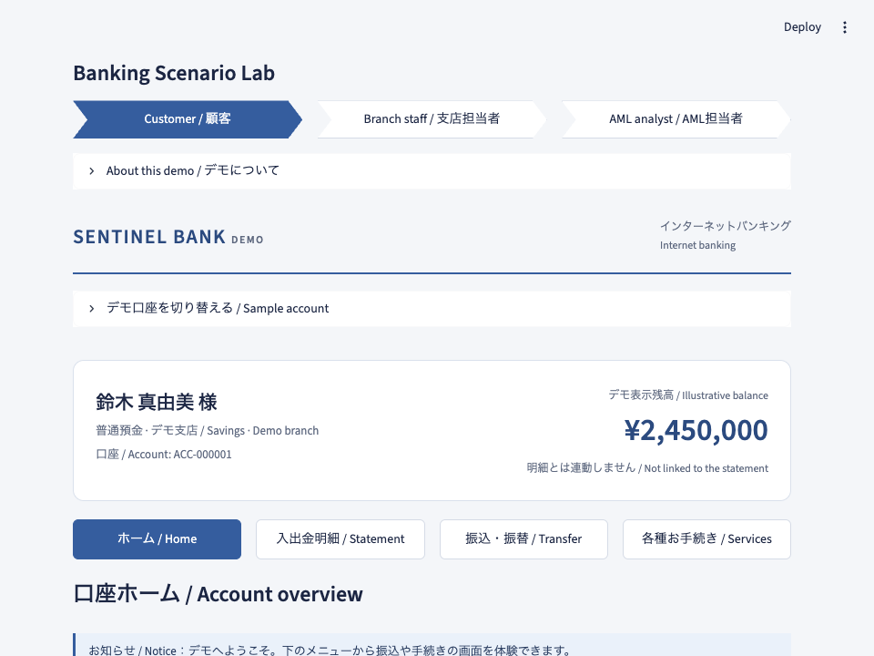
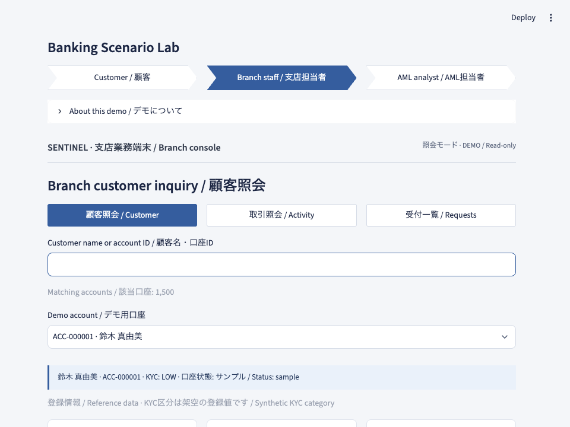
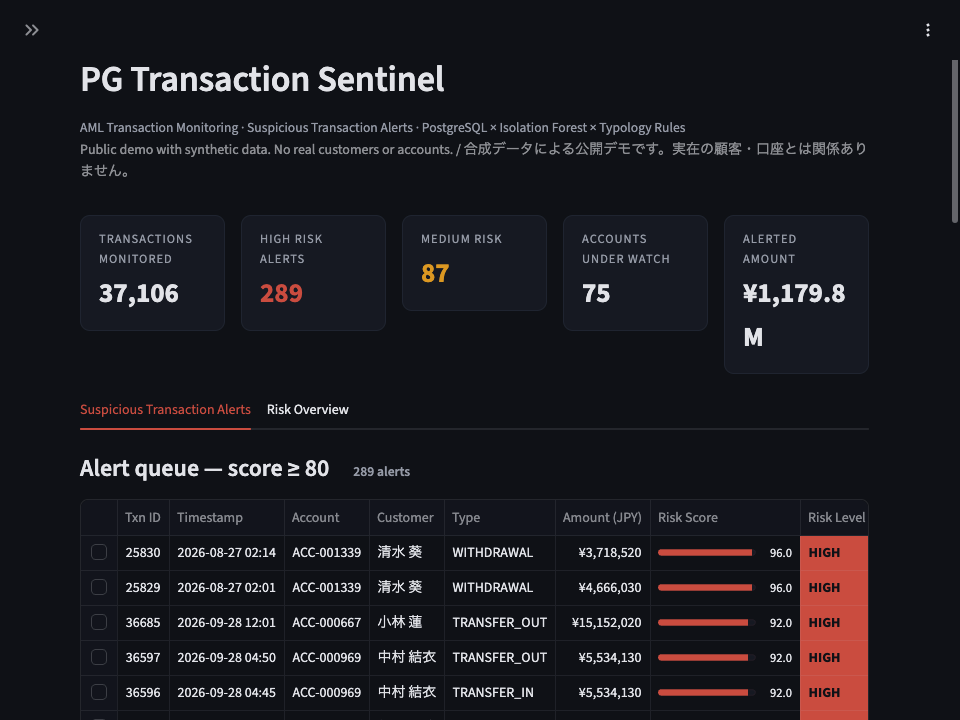
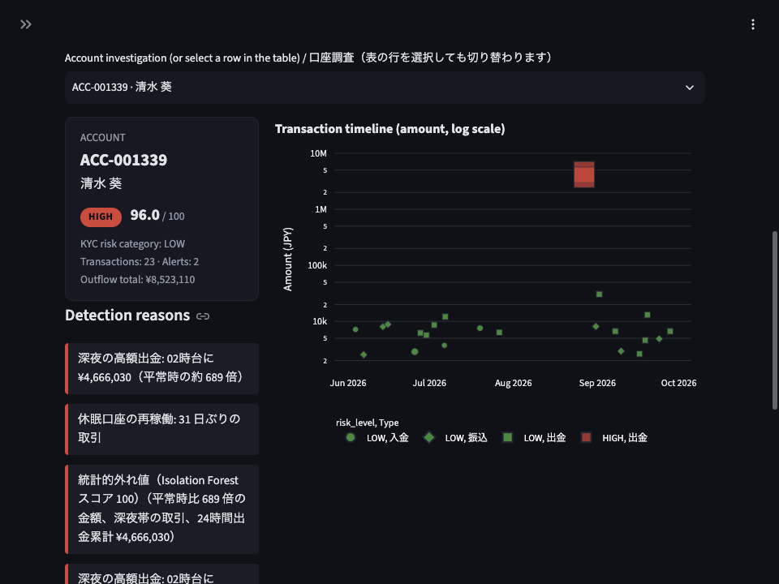
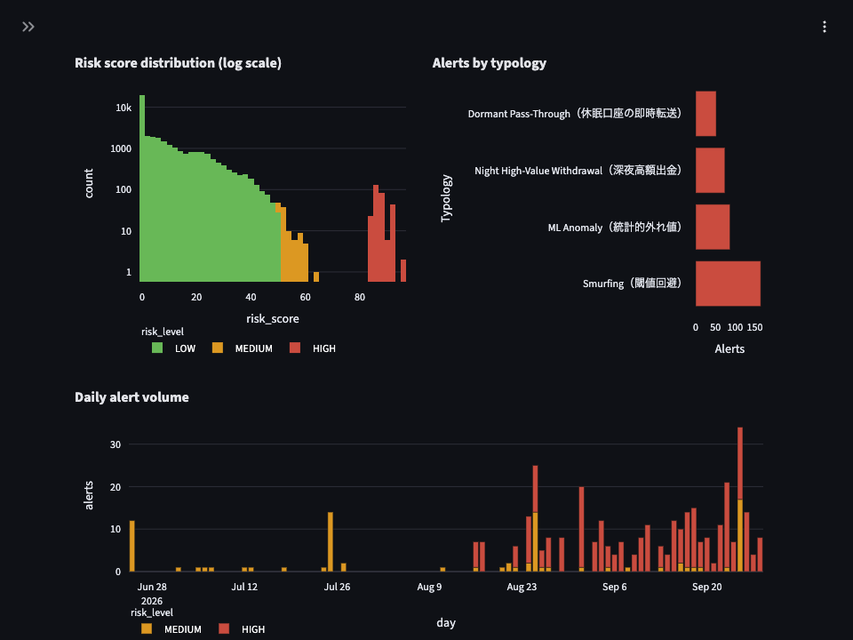

# PG Transaction Sentinel

**English** | [日本語](#日本語)

A banking demo collection built with Factory Desktop Droid, starting with a PostgreSQL × machine-learning anti-money laundering (AML) dashboard.

**Banking Scenario Lab** now includes 13 independent scenes: customer banking and account opening, branch and lending workflows, sales CRM, attendance, AML and Kafka monitoring, QuantLib pricing, synthetic-data tools, portfolio scoring, and LightGBM credit risk. Workflows keep changes in the browser session; calculations and explicitly configured integrations actually run. The original PG Transaction Sentinel remains the default AML scene.

PostgreSQL stores the core banking data. An Isolation Forest model (scikit-learn) and money-laundering typology rules give every transaction a risk score from 0 to 100, and a dark-mode Streamlit dashboard shows the alerts. The project is an example of building an enterprise-style prototype in a short time with AI-driven development ("vibe coding").

**[Try the live demo](https://aml-demo.trustyon.jp)**, hosted on Amazon Lightsail in Sydney. All data is synthetic, and re-scoring is disabled in the public demo.

## Background

Japanese banks have long run core systems on mainframes and commercial databases. To cut costs and move faster, more of them now use open-source-based technology such as PostgreSQL and Apache Kafka, driven by cloud migration of core banking systems and microservice architectures.

- **Sony Bank** moved its entire core banking system to AWS in May 2025. Its core banking and information system data are stored in Amazon Aurora PostgreSQL-Compatible Edition. ([AWS blog](https://aws.amazon.com/jp/blogs/news/casestudy-sonybank-core-banking-migration/), [Sony Bank press release](https://sonybank.jp/corporate/disclosure/press/2025/0507-01.html), [ASCII.jp](https://ascii.jp/elem/000/004/267/4267600/))
- **Japan Digital Design** (MUFG) published a case study of adopting Amazon Aurora DSQL, a PostgreSQL-compatible database. ([AWS blog, July 2026](https://aws.amazon.com/jp/blogs/news/db-customercase-japan-digital-design-dsql/))
- **Shared core banking systems for regional banks** are moving from mainframes to open architectures. One major vendor announced a rehost onto IA servers, RHEL, and PostgreSQL. In the MEJAR shared system used by Bank of Yokohama and others, the OS changes to Red Hat Enterprise Linux and the database to PostgreSQL. ([IIJ.news](https://www.iij.ad.jp/news/iijnews/vol_179/detail_04.html), [Nikkei xTECH](https://xtech.nikkei.com/atcl/nxt/column/18/00001/05491/))
- **Minna Bank** (Fukuoka Financial Group) built its core banking system on Google Cloud with microservices on Kubernetes and uses Apache Kafka for message queuing. ([ITmedia](https://www.itmedia.co.jp/enterprise/articles/1912/11/news125.html), [Nikkei xTECH](https://xtech.nikkei.com/atcl/nxt/column/18/01281/042100002/))

PostgreSQL stores the AML dashboard data. A separate, optional transfer-event scene can connect to Kafka; it is not part of AML scoring or the default deployment.

## Architecture

```
[ PostgreSQL 16 (Docker) ]
   ├── accounts                 Account master
   ├── transactions             Transaction history
   ├── aml_ground_truth         Injected scenarios (evaluation only)
   └── transaction_risk_scores  Scoring results
           │
           ▼
[ ml_engine.py ]  Features → Isolation Forest + typology rules → risk score
           │
           ▼
[ app.py (Streamlit) ]  Customer statement / branch inquiry / AML monitoring
```

| Layer | Technology |
| --- | --- |
| Database | PostgreSQL 16 (Docker Compose) |
| Data access | pandas, SQLAlchemy, psycopg2 (bulk load with COPY) |
| ML | scikit-learn (Isolation Forest) |
| GUI | Streamlit, Plotly |
| Tooling | uv, Ruff, pytest |

## Quick start

Requirements: Docker (Docker Desktop or Colima) and [uv](https://docs.astral.sh/uv/)

On macOS, LightGBM also needs OpenMP: `brew install libomp`. The Docker image includes the Linux runtime.

```bash
make setup   # Install dependencies and create .env
make up      # Start PostgreSQL (tables are created from db/init/*.sql)
make data    # Generate synthetic transactions and load them
make score   # Score transactions and save results (prints detection metrics)
make app     # Start the dashboard at http://localhost:8501
```

Example options for data generation: `uv run python generate_data.py --accounts 3000 --suspicious-ratio 0.05 --seed 1`

PostgreSQL and Streamlit listen on `localhost` only.

For a read-only preview, run `make demo` and open `http://localhost:8502/?scene=home`. Most new scenes also work without the AML database. See the [demo guide](docs/DEMO.md), [model notes](docs/MODELS.md), and [optional local integrations](docs/TOOLS.md).

## Injected suspicious patterns

By default the generator creates 1,500 accounts and about 37,000 transactions. It injects one of the following patterns into 5% of the accounts.

| Code | Pattern | Description |
| --- | --- | --- |
| `SMURFING` | Structuring below a threshold | Rapid transfers of JPY 950k–990k to stay under the JPY 1M reporting threshold. The funding deposit is also flagged |
| `NIGHT_HIGH_VALUE_WITHDRAWAL` | Night-time high-value withdrawal | An account that normally makes small payments suddenly withdraws millions of yen between 02:00 and 04:00 |
| `DORMANT_PASS_THROUGH` | Dormant account pass-through | A long-dormant account receives a large deposit and forwards the full amount within minutes |

## How scoring works

`ml_engine.py` builds these features for each transaction:

- Amount (log) and its ratio to the median of the account's previous transactions (no future data is used)
- Night-time flag (00:00–05:00)
- Total outflow in the last 24 hours
- Number of just-below-threshold transfers within ±24 hours (batch monitoring, so the first transfers of a burst are also caught)
- Dormancy (days since the previous transaction)
- Pass-through ratio (outflow ÷ deposit when money leaves within 60 minutes of a deposit)

The risk score combines the Isolation Forest anomaly score with typology rule hits. Each alert has a readable detection reason, for example "深夜の高額出金: 02時台に ¥4,666,030（平常時の約 689 倍）" (night-time high-value withdrawal: JPY 4,666,030 at 02:00, about 689 times the usual amount).

| Risk level | Score | Color |
| --- | --- | --- |
| HIGH | 80 or more | Red |
| MEDIUM | 50 to under 80 | Yellow |
| LOW | Under 50 | Green |

On the default data, precision and recall are both 1.000 (an alert means a score of 80 or more). These numbers come from synthetic data with clear patterns and do not show performance on real data.

## Banking demo scenes

The chevrons switch perspectives; they are not sequential workflow steps. **Gallery** opens the complete collection, while **More demos** contains additional scene shortcuts. Direct URLs and a three-minute walkthrough are in [docs/DEMO.md](docs/DEMO.md).

| User | Demo |
| --- | --- |
| Customer | White/blue internet-banking home, sample balance, statements, transfer preview and service menus; separate campaign/application demo |
| Branch and lending staff | Restrained customer inquiry, KYC reference, transactions, requests, loan cases and repayment calculations |
| Sales manager and representative | CRM-style pipeline dashboard and shared session-local opportunity registration |
| Employee | Clock-in/out, breaks, attendance history and leave requests |
| AML analyst | Investigate suspicious transactions using the existing alert queue, detection reasons, timeline, and risk overview |
| Analytics and development | Kafka events, QuantLib prices/Greeks, portfolio scoring, LightGBM credit review, synthetic-data tools |

Role switching is a demonstration, **not login or access control**. All users may explore the fictional accounts. `ACC-000002` is selected initially when available. The customer balance is a labeled, fixed sample and is not derived from statements; net movement is not a balance. KYC is synthetic reference data. Workflows do not submit real applications or payments. Local data tools require explicit opt-in and server-side checks; public mode blocks provisioning. See the demo guide for each scene's limitations.

### Banking UI previews

Captured from the local build, not evidence of an AWS deployment.





## AML dashboard

- **Suspicious Transaction Alerts**: Alert queue sorted by score. Selecting a row opens that account in the investigation panel
- **Account investigation**: Account profile, risk badge, detection reasons, transaction timeline (Plotly), and transaction history
- **Risk Overview**: Score distribution, alerts by typology, and daily alert volume
- Sidebar: Filters for score threshold, typology, and period, plus a re-score button

### Screenshots

Captured from the [live demo](https://aml-demo.trustyon.jp) on October 7, 2026. All customers, accounts, and transactions shown are synthetic.

**Alert queue / アラート一覧**



**Account investigation / 口座別調査**



**Risk overview / リスク概況**



## Development

```bash
make test     # pytest (also runs a dashboard rendering test when the database is up)
make lint     # Ruff lint and format check
make format   # Auto-fix
```

## Deployment

The same stack can be published on a single Amazon Lightsail instance (USD 12/month) with Docker Compose and Caddy for automatic HTTPS. Only Caddy is exposed to the internet, and the public demo mode (`PUBLIC_DEMO=true`) disables re-scoring. See [docs/DEPLOY.md](docs/DEPLOY.md).

```bash
docker compose -f docker-compose.prod.yml up -d --build
```

## Project structure

```
├── docker-compose.yml        PostgreSQL container (local development)
├── docker-compose.prod.yml   PostgreSQL + app + Caddy (deployment)
├── Dockerfile                App image
├── deploy/Caddyfile          Reverse proxy and HTTPS
├── docs/DEPLOY.md            Deployment guide
├── docs/DEMO.md              Demo walkthrough and honest feature boundaries
├── docs/MODELS.md            Portfolio and credit model notes
├── docs/TOOLS.md             Optional local Kafka/Keycloak/sandbox integrations
├── db/init/01_schema.sql     Table definitions
├── config.py                 Database connection, risk thresholds, public demo flag
├── db.py                     Bulk load with COPY
├── generate_data.py          Synthetic data generator
├── ml_engine.py              Features and scoring
├── bootstrap.py              First-run data setup for deployments
├── app.py                    Streamlit dashboard
├── banking_scenes.py         Shared chevron header, customer and branch demos
├── demos/                    Independent workflows, analytics, and scene gallery
├── demo_tools/               Local messaging and synthetic-data integrations
├── .streamlit/config.toml    Dark theme
└── tests/                    pytest
```

## Disclaimer

All data is synthetic and fictional. It is not related to any real person or account. This repository is a tech demo and is not intended for real AML operations.

## License

[MIT](LICENSE)

---

## 日本語

[English](#pg-transaction-sentinel) | **日本語**

Factory デスクトップ版 Droid と作った銀行業務デモ集です。PostgreSQL と機械学習による、不審取引（AML）検知ダッシュボードから始めました。

**Banking Scenario Lab** は 13 の独立したシーンを持ちます。顧客・口座開設、支店・融資、営業 CRM、勤怠、AML・Kafka 監視、QuantLib、テストデータ作成、ポートフォリオ、LightGBM 与信を体験できます。業務操作はブラウザのデモ内だけに保持し、計算や明示的に設定した連携は実際に実行します。初期画面は従来の PG Transaction Sentinel の AML デモです。

PostgreSQL に勘定系のデータを保存します。Isolation Forest（scikit-learn）と、典型的なマネロン手口（タイポロジー）のルールを組み合わせて、各取引に 0〜100 の不審度スコアを付けます。結果はダークモードの Streamlit ダッシュボードに表示します。AI 主導の開発（バイブコーディング）で、エンタープライズ向けのプロトタイプを短時間で作る例として公開しています。

**[公開デモを試す](https://aml-demo.trustyon.jp)**。Amazon Lightsail のシドニーリージョンで稼働しています。データはすべて架空の合成データで、公開デモでは再スコアリングを無効にしています。

### 背景

日本の銀行では、長くメインフレームや商用データベースが勘定系を支えてきました。近年は、コスト削減と開発の俊敏性を目的に、勘定系のクラウド移行やマイクロサービス化が進んでいます。それにともない、PostgreSQL や Apache Kafka といったオープンソース由来の技術の採用が広がっています。

- **ソニー銀行**は 2025 年 5 月に、勘定系システム全体を AWS へ移行しました。勘定系データや情報系データは、Amazon Aurora PostgreSQL 互換エディションに保存しています。（[AWS ブログ](https://aws.amazon.com/jp/blogs/news/casestudy-sonybank-core-banking-migration/)、[ソニー銀行プレスリリース](https://sonybank.jp/corporate/disclosure/press/2025/0507-01.html)、[ASCII.jp](https://ascii.jp/elem/000/004/267/4267600/)）
- **Japan Digital Design**（MUFG）は、PostgreSQL 互換の Amazon Aurora DSQL を導入した事例を公開しています。（[AWS ブログ、2026 年 7 月](https://aws.amazon.com/jp/blogs/news/db-customercase-japan-digital-design-dsql/)）
- **地銀向けの勘定系共同システム**では、メインフレームからオープン系への移行が進んでいます。大手ベンダーの 1 社は、IA サーバ・RHEL・PostgreSQL の上にリホストする方針を示しています。横浜銀行などが使う共同システム MEJAR でも、OS を Red Hat Enterprise Linux に、データベースを PostgreSQL に置き換えます。（[IIJ.news](https://www.iij.ad.jp/news/iijnews/vol_179/detail_04.html)、[日経クロステック](https://xtech.nikkei.com/atcl/nxt/column/18/00001/05491/)）
- **みんなの銀行**（ふくおかフィナンシャルグループ）は、Google Cloud 上に勘定系システムを構築しました。Kubernetes によるマイクロサービス構成で、メッセージキューに Apache Kafka を使っています。（[ITmedia](https://www.itmedia.co.jp/enterprise/articles/1912/11/news125.html)、[日経クロステック](https://xtech.nikkei.com/atcl/nxt/column/18/01281/042100002/)）

AML ダッシュボードのデータ保存には PostgreSQL を使います。独立した任意の振込イベント画面では Kafka に接続できますが、AML のスコアリングや標準のデプロイ構成には含まれません。

### アーキテクチャ

```
[ PostgreSQL 16 (Docker) ]
   ├── accounts                 口座マスタ
   ├── transactions             取引履歴
   ├── aml_ground_truth         埋め込んだ不審シナリオ（評価専用）
   └── transaction_risk_scores  スコアリング結果
           │
           ▼
[ ml_engine.py ]  特徴量生成 → Isolation Forest + タイポロジールール → 不審度スコア
           │
           ▼
[ app.py (Streamlit) ]  顧客の入出金照会 / 支店の顧客照会 / AML モニタリング
```

| 層 | 技術 |
| --- | --- |
| DB | PostgreSQL 16（Docker Compose） |
| データ操作 | pandas, SQLAlchemy, psycopg2（COPY による一括投入） |
| ML | scikit-learn（Isolation Forest） |
| GUI | Streamlit, Plotly |
| 開発ツール | uv, Ruff, pytest |

### クイックスタート

前提: Docker（Docker Desktop または Colima）と [uv](https://docs.astral.sh/uv/)

macOS の LightGBM には OpenMP が必要です。`brew install libomp` で準備します。Docker イメージには Linux 用の実行ライブラリを含めています。

```bash
make setup   # 依存パッケージのインストールと .env の作成
make up      # PostgreSQL を起動（db/init/*.sql でテーブルを自動作成）
make data    # ダミー取引データを生成して投入
make score   # 不審度スコアを計算して DB に保存（検知精度も表示）
make app     # http://localhost:8501 でダッシュボードを起動
```

データ生成のオプション例: `uv run python generate_data.py --accounts 3000 --suspicious-ratio 0.05 --seed 1`

PostgreSQL と Streamlit は `localhost` だけで待ち受けます。

閲覧用プレビューは `make demo` で起動し、`http://localhost:8502/?scene=home` を開きます。追加シーンの多くは AML 用 DB がなくても動きます。[デモガイド](docs/DEMO.md#日本語)、[モデル説明](docs/MODELS.md)、[ローカル連携](docs/TOOLS.md)も参照してください。

### 埋め込んでいる不審取引パターン

既定では 1,500 口座、約 37,000 件の取引を生成し、口座の 5% に次のいずれかのパターンを埋め込みます。

| コード | パターン | 内容 |
| --- | --- | --- |
| `SMURFING` | スマーフィング（閾値回避） | 100 万円の閾値を避け、95〜99 万円の送金を短時間に連続して行う。原資の入金もあわせて検知 |
| `NIGHT_HIGH_VALUE_WITHDRAWAL` | 深夜の高額出金 | 普段は少額利用の口座から、午前 2〜4 時に数百万円を連続出金 |
| `DORMANT_PASS_THROUGH` | 休眠口座の即時転送 | 長期間取引のない口座に大金が入金され、数分以内に全額が別口座へ送金される |

### スコアリングの仕組み

`ml_engine.py` は取引ごとに次の特徴量を作ります。

- 金額（対数）と、口座の過去取引の中央値に対する倍率（未来の情報は使わない）
- 深夜帯フラグ（0〜5 時）
- 直近 24 時間の出金累計
- 前後 24 時間の「閾値直下送金」の件数（事後モニタリングを想定し、連続送金の最初の数件もさかのぼって検知）
- 休眠日数（前回取引からの経過日数）
- 入金直後の転送比率（入金から 60 分以内の出金額 ÷ 入金額）

スコアは「Isolation Forest の異常度」と「タイポロジールールの該当」を組み合わせて計算します。各アラートには、「深夜の高額出金: 02時台に ¥4,666,030（平常時の約 689 倍）」のような検知理由が付きます。

| リスクレベル | スコア | 色 |
| --- | --- | --- |
| HIGH | 80 以上 | 赤 |
| MEDIUM | 50 以上 80 未満 | 黄 |
| LOW | 50 未満 | 緑 |

既定データでの結果は、適合率・再現率ともに 1.000 です（スコア 80 以上を検知とみなした場合）。これは手口が明確な合成データでの数字で、実データでの性能を示すものではありません。

### 利用者別の銀行業務デモ

シェブロンは独立した視点を切り替えるナビで、業務の進行ステップではありません。**Gallery / デモ一覧** に全画面をまとめ、**More demos / 他のデモ** からも切り替えられます。直接開く URL と 3 分の実演手順は [docs/DEMO.md](docs/DEMO.md#日本語) にまとめています。

| 利用者 | デモ |
| --- | --- |
| 顧客 | 白・青の口座ホーム、サンプル残高、明細、振込プレビュー、各種メニュー。別シーンで口座開設 LP と申込 |
| 支店・融資担当者 | 淡白な顧客照会、KYC 登録値、取引、受付一覧、融資案件、返済試算 |
| 営業マネージャー・担当者 | CRM 風の集計画面と、同じブラウザで共有する商談登録 |
| 行員 | 出退勤・休憩・勤怠一覧・休暇申請 |
| AML 担当者 | 従来のアラート一覧・検知理由・取引タイムライン・リスク概況で不審取引を調査します |
| 分析・開発 | Kafka、QuantLib、ポートフォリオ、LightGBM 与信、金融テストデータ作成 |

役割の切り替えは体験用であり、**ログインやアクセス権管理ではありません**。口座は `ACC-000002` を初期選択します。残高は明記した固定サンプルで、明細や入出金差額とは連動しません。KYC も架空の登録値です。実際の申込や送金は行いません。ローカルのデータ作成ツールには明示的な有効化とサーバー側の確認が必要で、公開モードでは書き込みを遮断します。各画面の制約はデモガイドをご覧ください。

#### 銀行 UI のプレビュー

ローカルビルドの画像です。AWS への反映を示すものではありません。[顧客・支店 UI の画像](#banking-ui-previews)をご覧ください。

### AML ダッシュボード

- **Suspicious Transaction Alerts**: スコア順のアラート一覧。行を選ぶと、その口座が調査パネルに表示されます
- **Account investigation**: 口座情報、リスクバッジ、検知理由、取引タイムライン（Plotly）、取引履歴
- **Risk Overview**: スコア分布、タイポロジー別の件数、日次のアラート推移
- サイドバー: しきい値・タイポロジー・期間のフィルタと、再スコアリングボタン

#### スクリーンショット

2026 年 10 月 7 日に[公開デモ](https://aml-demo.trustyon.jp)から撮影しました。表示されている顧客・口座・取引はすべて架空の合成データです。[アラート一覧・口座別調査・リスク概況の画像](#screenshots)をご覧ください。

### 開発

```bash
make test     # pytest（DB が起動していれば、ダッシュボードの描画テストも実行）
make lint     # Ruff による lint とフォーマットチェック
make format   # 自動修正
```

### デプロイ

同じ構成を、Amazon Lightsail のインスタンス 1 台（月 12 米ドル）で公開できます。Docker Compose で動かし、Caddy が HTTPS を自動で設定します。インターネットに公開するのは Caddy だけで、公開デモモード（`PUBLIC_DEMO=true`）では再スコアリングを無効にします。手順は [docs/DEPLOY.md](docs/DEPLOY.md#日本語) を参照してください。

```bash
docker compose -f docker-compose.prod.yml up -d --build
```

### ファイル構成

```
├── docker-compose.yml        PostgreSQL コンテナ（ローカル開発用）
├── docker-compose.prod.yml   PostgreSQL + アプリ + Caddy（公開用）
├── Dockerfile                アプリのイメージ
├── deploy/Caddyfile          リバースプロキシと HTTPS
├── docs/DEPLOY.md            デプロイ手順書
├── docs/DEMO.md              デモ実演と機能・サンプルの区別
├── docs/MODELS.md            ポートフォリオ・与信モデルの説明
├── docs/TOOLS.md             ローカル Kafka・Keycloak・専用 DB 領域
├── db/init/01_schema.sql     テーブル定義
├── config.py                 DB 接続、リスクしきい値、公開デモの設定
├── db.py                     COPY による一括投入
├── generate_data.py          ダミーデータ生成
├── ml_engine.py              特徴量生成とスコアリング
├── bootstrap.py              公開環境の初回データ準備
├── app.py                    Streamlit ダッシュボード
├── banking_scenes.py         共通シェブロンヘッダー、顧客・支店デモ
├── demos/                    業務・分析シーンとデモ一覧
├── demo_tools/               ローカル電文・テストデータ連携
├── .streamlit/config.toml    ダークテーマ
└── tests/                    pytest
```

### 注意

データはすべて架空の合成データで、実在の人物・口座とは関係ありません。本リポジトリは技術デモであり、実際の AML 業務での利用を想定したものではありません。

### ライセンス

[MIT](LICENSE)
